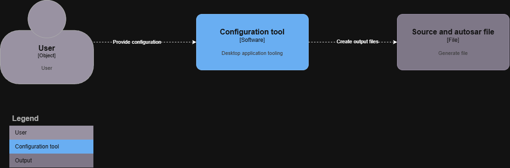
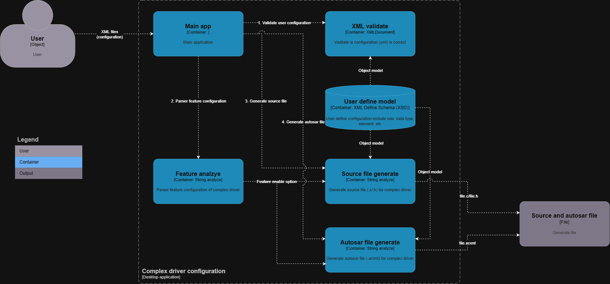
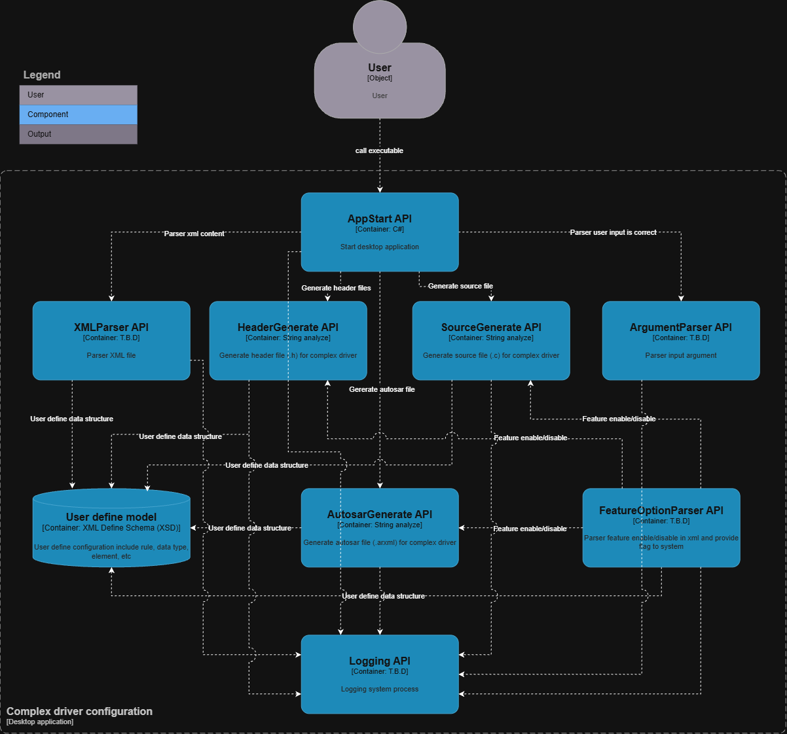

# Overview

This project is create an configuration tool by reading the xml file and generator source file (.c/.h) and autosar file (.arxml)

## Diagram

### System diagram

### Container diagram

### Component diagram

